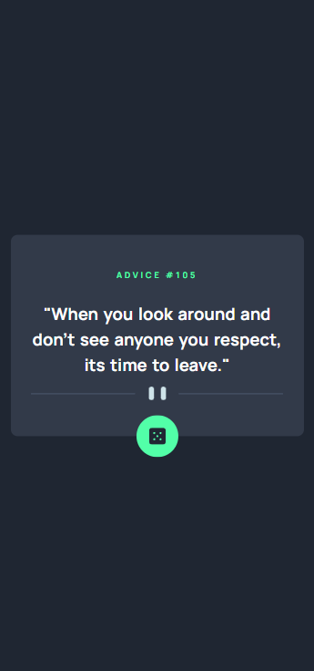
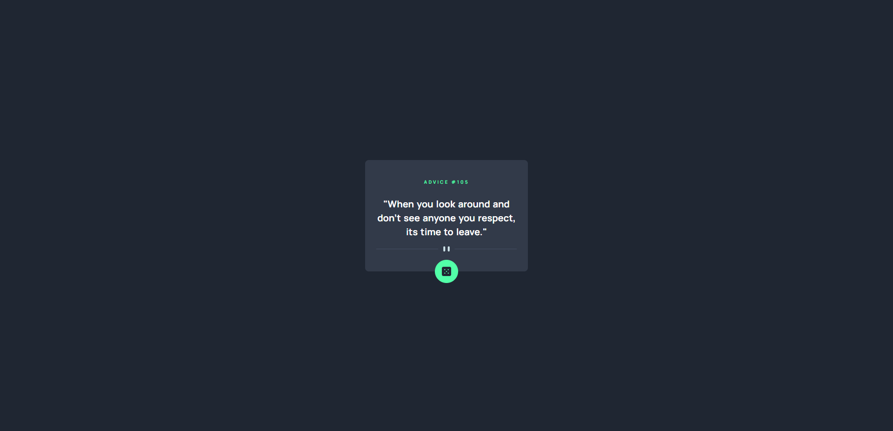

# Frontend Mentor - Advice generator app solution

This is a solution to the [Advice generator app challenge on Frontend Mentor](https://www.frontendmentor.io/challenges/advice-generator-app-QdUG-13db).

## Table of contents

- [Frontend Mentor - Advice generator app solution](#frontend-mentor---advice-generator-app-solution)
  - [Table of contents](#table-of-contents)
  - [Overview](#overview)
    - [The challenge](#the-challenge)
    - [Solution screenshot](#solution-screenshot)
      - [Mobile](#mobile)
      - [Desktop](#desktop)
    - [Links](#links)
  - [My process](#my-process)
    - [Built with](#built-with)
  - [Project Setup](#project-setup)
    - [Compile and Hot-Reload for Development](#compile-and-hot-reload-for-development)
    - [Compile and Minify for Production](#compile-and-minify-for-production)
  - [Author](#author)
  - [Acknowledgments](#acknowledgments)

## Overview

### The challenge

Users should be able to:

- View the optimal layout depending on their device's screen size.

### Solution screenshot

#### Mobile



#### Desktop



### Links

- Solution URL: [Advice generator app challenge on Frontend Mentor](https://www.frontendmentor.io/solutions/app-using-vuejs--MIwfqIRmz)
- Live Site URL: [Solution on github pages.](https://mooenz.github.io/portfolio-frontendmentor/advice-generator-app-main/)

## My process

### Built with

- [Vue.js](https://vuejs.org/) - Framework
- [Axios](https://axios-http.com/docs/intro) - Module

## Project Setup

```sh
npm install
```

### Compile and Hot-Reload for Development

```sh
npm run dev
```

### Compile and Minify for Production

```sh
npm run build
```

## Author

- Website - [Mooenz cv](https://mooenz.github.io/curriculum-vitae/)
- Frontend Mentor - [@Mooenz](https://www.frontendmentor.io/profile/Mooenz)
- Twitter - [@MooenzDev](https://www.twitter.com/MooenzDev)

## Acknowledgments

Thanks frontend mentor for this free challenges.
